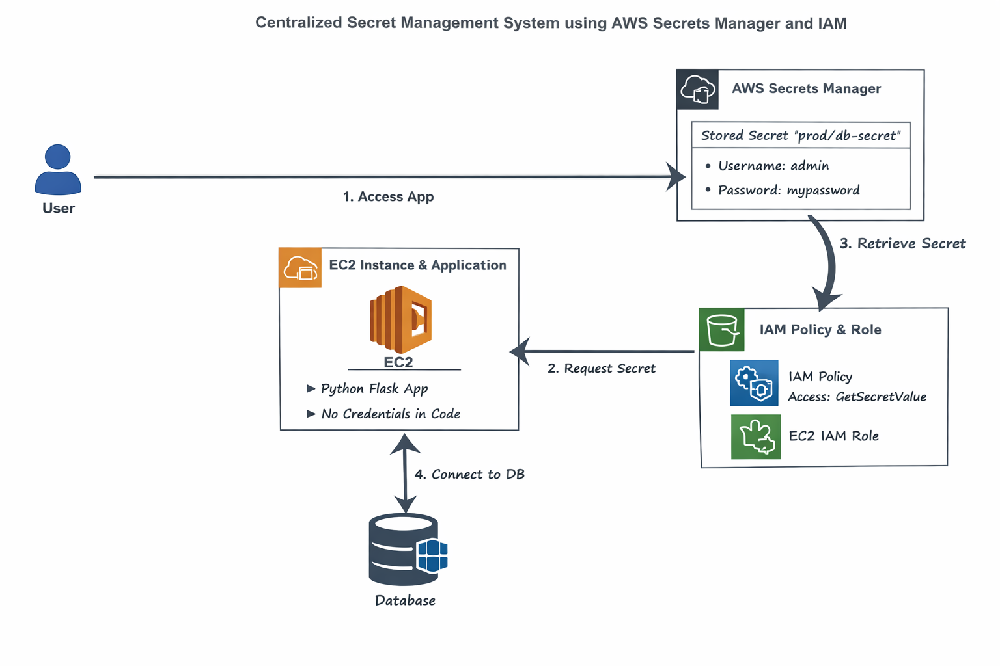
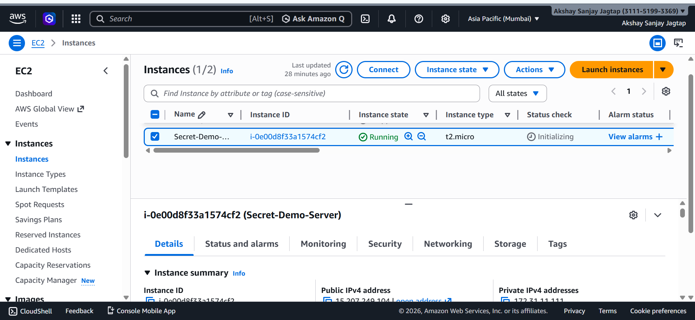
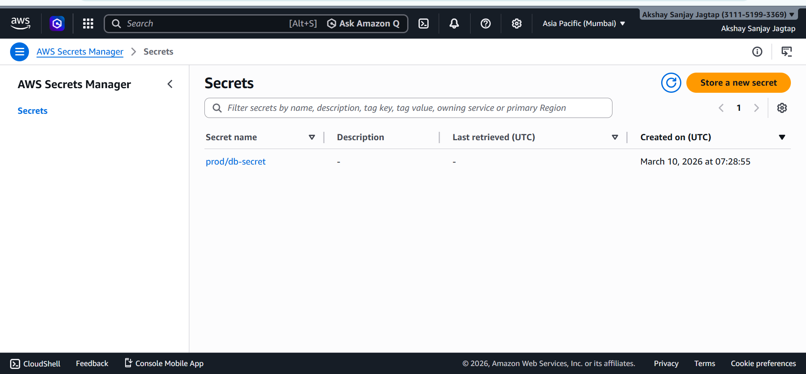
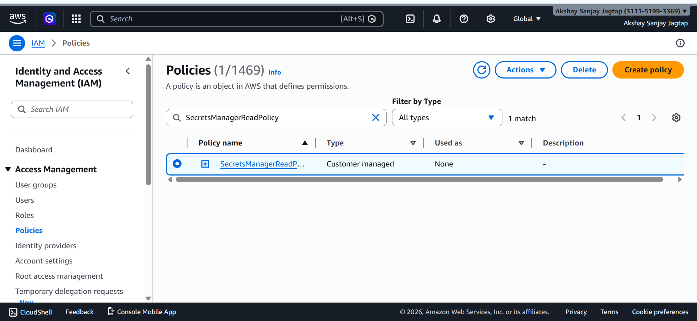
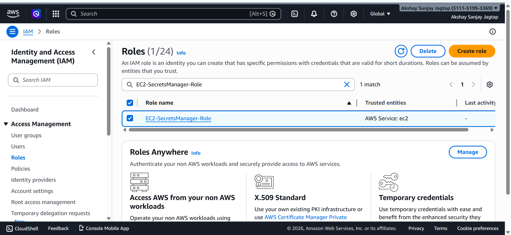
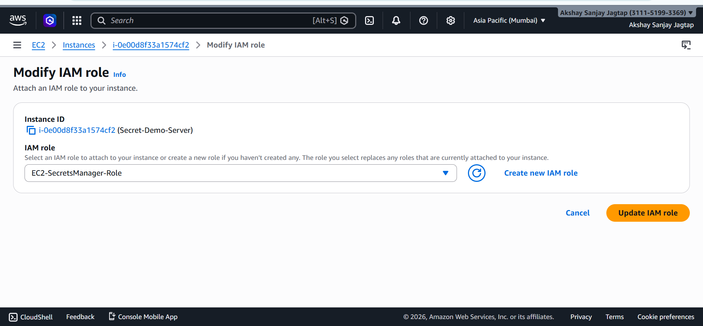
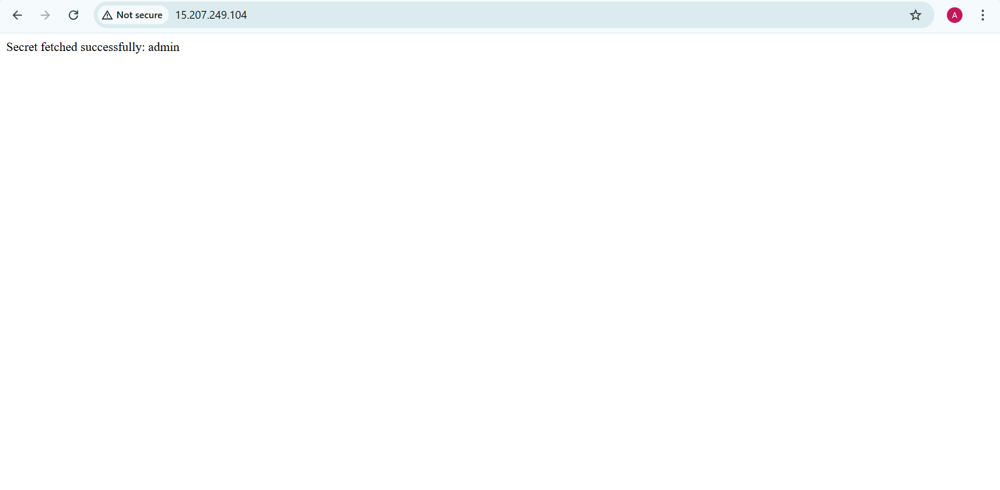
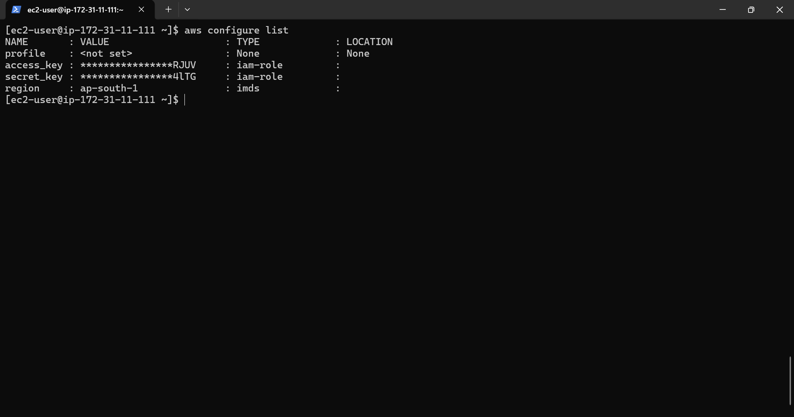

# Centralized Secret Management System using AWS Secrets Manager and IAM

## Project Overview:

This project demonstrates how to eliminate hardcoded secrets from applications and implement a secure centralized secret management system using AWS services.

In many real-world environments, developers store database credentials directly inside configuration files or application code. This practice is insecure and can expose sensitive information if the code is leaked.

To solve this issue, this project uses AWS Secrets Manager and IAM roles so that the application retrieves secrets dynamically at runtime without storing credentials in the code.

---
## Architecture Diagram:

---

## Architecture Flow:
```
User → Web Browser → EC2 Instance → Application (Python Flask) → AWS Secrets Manager → Secret (DB Username & Password)
```
---

## Technologies Used:

* Amazon EC2
* AWS Secrets Manager
* AWS Identity and Access Management (IAM)
* Python
* Flask
* Boto3 SDK

---

## Project Workflow:

### Step 1 – Deploy EC2 Instance:

* Launch an EC2 instance.
* Connect to the instance using SSH.
* Install Python and required packages.

Output:


Commands used:

```
sudo yum update -y
sudo yum install python3 -y
pip3 install flask boto3 pymysql
```

---

### Step 2 – Create Sample Application with Hardcoded Secret:

Cretae file:
```
sudo nano app.py
```
Example application:

```
from flask import Flask

app = Flask(__name__)

# Hardcoded credentials (BAD PRACTICE)
db_user = "admin"
db_password = "mypassword"

@app.route("/")
def home():
    return f"Connected using {db_user}"

app.run(host="0.0.0.0", port=80)
```

This demonstrates the insecure practice of storing credentials inside the code.

Output:


---

### Step 3 – Store Secret in AWS Secrets Manager:

Open AWS Secrets Manager and create a new secret.

Secret values:

```
username : admin
password : mypassword
```

Secret name:

```
prod/db-secret
```

AWS encrypts the secret using AWS KMS.

Output:


---

### Step 4 – Create IAM Policy:

Policy JSON:

```
{
  "Version": "2012-10-17",
  "Statement": [
    {
      "Effect": "Allow",
      "Action": ["secretsmanager:GetSecretValue"],
      "Resource": "*"
    }
  ]
}
```

Policy Name:

```
SecretsManagerReadPolicy
```
Output:


---

### Step 5 – Create IAM Role for EC2:

1. Go to IAM → Roles
2. Create Role
3. Trusted entity → AWS Service
4. Use case → EC2
5. Attach policy → SecretsManagerReadPolicy

Role Name:

```
EC2-SecretsManager-Role
```
Output:


---

### Step 6 – Attach Role to EC2 Instance:

EC2 Console → Instance → Actions → Security → Modify IAM Role.

Attach:

```
EC2-SecretsManager-Role
```
Output:


---

### Step 7 – Modify Application to Fetch Secret:

Install boto3:

```
pip3 install boto3
```
File:
```
sudo nano app.py
```

Application code:

```
from flask import Flask
import boto3
import json

app = Flask(__name__)

def get_secret():

    client = boto3.client("secretsmanager", region_name="ap-south-1")

    response = client.get_secret_value(
        SecretId="prod/db-secret"
    )

    secret = json.loads(response["SecretString"])

    return secret

@app.route("/")
def home():

    secret = get_secret()

    username = secret["username"]

    return f"Secret fetched successfully: {username}"

app.run(host="0.0.0.0", port=80)
```

Now the application dynamically retrieves credentials from AWS Secrets Manager.

Output:


---

## Security Validation:

To confirm that no credentials are stored on the server:

```
aws configure list
```
Output:


Output should show that the application is using the IAM role instead of access keys.

---

## Why Secret Rotation Matters:

Secret rotation automatically updates credentials at regular intervals. This reduces the risk of credential exposure and ensures that compromised credentials become invalid quickly.

AWS Secrets Manager supports automatic rotation which improves security and compliance.

---

## Security Improvements Achieved:

* No hardcoded credentials in application code
* Centralized secret storage
* Encrypted secrets using AWS KMS
* Least privilege access using IAM policy
* Secure secret retrieval using IAM role

---
## Conclusion:

This project demonstrates a secure approach to managing application secrets using AWS Secrets Manager and IAM roles. By removing hardcoded credentials and implementing centralized secret management, organizations can significantly improve application security and compliance.

---
### Author: Akshay Jagtap

---
